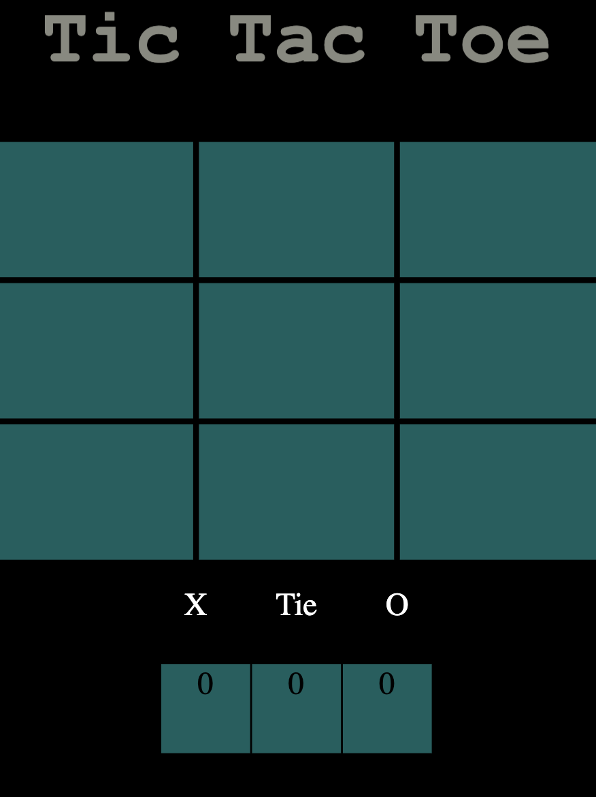

# Tic tac toe game project 


# Introduction


* its a tic tac toe game Requires 2 players 
* and a counter to count the Winning and tie Rounds
* and printing the results . 
# my Project Deployment 


# the tools used in the Project :
* HTML
* CSS 
* JS 
* Jquery
* [sound](http://soundbible.com/tags-click.html)
* [animated](https://daneden.github.io/animate.css/)

___
# Wireframes and Stories :

* counting the score for each player.
* play reset button to play a new game.
* When the score apper the click should be off 
* adding a audio to react with the players
__
# the Developing stepes:
* Starting with a simple HTML file and basic CSS.
* Dividing my game into steps .
* start with a o for the first click .
*switching between X and O.
* Recognise the winner and print it .
* Get the score for each player and display it underneath the board.
* restarting the game without refresh the page it self .
* Adding audio when clicking on the divs and if someone wins .
____


# Interfaces :

# game Bored 

```    

```
___

### print the winner name using Jquery Function

```js 
winner=function(){
    if ( cur === true  ){
        audiow.play();
    $('.box > div').off()
    $(".winner").html("<h2>you are the winner x</h2>");
    xwin++
    $(".x").html(xwin);
    }
    else {
        audiow.play();
    $('.box > div').off()
    $(".winner").html("<h2>you are the winner o</h2>");
    owin++
    $(".o").html(owin);
} 
```
# Difficulties :
how to switch between x and o logically 

# Unsolved and Uncomplicated Features :
* adding name and choose x or o feature 
* adding playing against computer using AI 
* adding timmer to the game 


